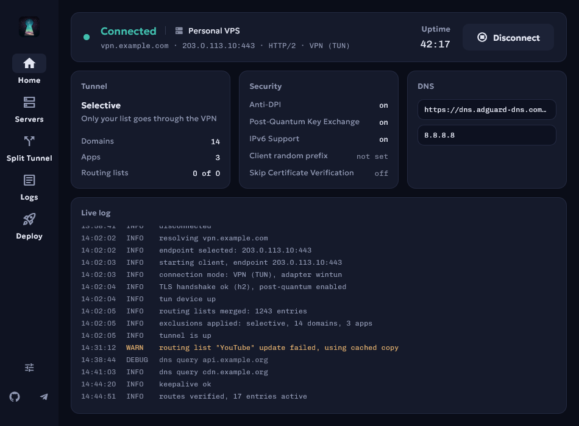

<p align="center">
  
</p>

# Trusty — VPN Client

[](https://www.microsoft.com/windows)
[](https://www.apple.com/macos)
[](LICENSE)
[](https://flutter.dev)
[](../../releases)

<p align="center">
  
</p>

**Trusty** is a cross-platform GUI client for [TrustTunnel VPN](https://github.com/TrustTunnel/TrustTunnel).

> **Platforms:** Windows 10/11, macOS 11+
> **Status:** Community-developed GUI wrapper for the TrustTunnel CLI. See [CHANGELOG.md](CHANGELOG.md) for the release history

## Features

Trusty is a desktop front end for the TrustTunnel CLI. It holds your servers and credentials, keeps
your routing rules, writes the client configuration and runs the client, so none of that has to
happen in a terminal.

### Connecting

- One button connects and disconnects, from the Home screen or from the tray menu
- Two connection modes: a system-wide VPN through a virtual adapter (Wintun on Windows, utun on macOS), or a local SOCKS5 proxy on `127.0.0.1` that creates no adapter at all
- HTTP/2 or HTTP/3, chosen per server
- The kill switch is always on, so traffic meant for the tunnel is not sent direct if the endpoint connection is lost
- Failed connects are explained in words: an expired or untrusted certificate, missing administrator rights, an adapter still busy, a lost macOS tunnel permission
- While connected, Home shows the endpoint, protocol, mode and an uptime counter

### Servers

- Keep any number of servers, one card each, and switch the active one with a click
- Per server: hostname, address, port, credentials, protocol, IPv6, Anti-DPI, post-quantum key exchange, custom SNI, certificate verification and the connection-filtering prefix
- **Test** checks that the host is reachable and speaks TLS and reports whether the certificate validated, before you save. A server that filters connections answers an unmarked probe with silence, and the result says so instead of calling it a failure
- Passwords and filtering prefixes are kept in the OS keystore (Windows DPAPI, macOS Keychain)
- DNS upstreams are shared by every server and take plain IPs, DoH, DoT and DoQ, with a preset menu for the common resolvers
- Server settings and the active-server choice are locked while a connection is up; disconnect to edit or switch

### Split Tunneling

- **General** sends everything through the VPN except your exclusions; **Selective** sends only what you list
- Entries can be domains, wildcard domains, IPs, CIDR ranges and applications, matched by process name
- Paste a URL, a bare domain, an IP or a CIDR and it is normalized and validated (`https://VK.com/feed` becomes `vk.com`); a whole block can be imported at once
- Right after you add a domain, Trusty can fetch that site once and offer the third-party hostnames it references as a group
- While the Split Tunnel screen is open, domain-like strings from the live log are offered as suggestions
- Rules stay editable while connected and apply on the next connect

### Routing lists

Ready-made sets of domains and IP ranges you can switch on instead of typing entries by hand. No
list is active until you add one. The catalogue opens with the "sites blocked in Russia" set
([itdoginfo/allow-domains](https://github.com/itdoginfo/allow-domains)), followed by per-service and
per-country lists, and you can add your own from a raw URL or a local file. Each list applies in
Selective mode, General mode or both, can be removed again, and can be checked before you commit to
it. When you connect, enabled lists that apply in the current mode are refreshed if their
downloaded copy is over 24 hours old.

### Deploying a server

The **Deploy** tab installs a TrustTunnel server on a VPS over SSH: it verifies the host key,
installs the software, uploads the configuration, obtains a Let's Encrypt certificate and starts the
service. It can generate the VPN password for you, and a connection-filtering prefix so the server
answers only your client and ignores probes. Afterwards one press saves the server into your list.

### Logs

Live output from the client with All / Errors / Warnings filters and counts, copy and clear, an
auto-scroll toggle and the client's own log level.

### Interface

The interface is a set of flat cards that fill the window, with a palette drawn from the app icon.
The typefaces ship with the app (Geologica for the interface, Chivo Mono for values you read as
data), so it renders the same on every machine, and light and dark follow the OS setting. There is
no separate settings screen: each app-wide control sits beside what it governs.

Trusty puts an icon in the system tray whose menu connects, disconnects, shows the window or exits;
the tooltip and that menu item follow whether the tunnel is up. Closing the window can ask, minimize
to the tray or exit, and that choice is the one setting that takes effect straight away. Launching
Trusty a second time raises the running copy instead of opening a second window.

### Security

- VPN passwords and connection-filtering prefixes are kept in OS-provided secure storage (Windows DPAPI, macOS Keychain) rather than in the settings file
- The SSH password for a deployment is held in memory for that deployment only and never written to disk. The host, port, SSH username and key path are saved so the form is pre-filled next time
- SSH host-key pinning (trust on first use) protects a deployment from a man in the middle
- Values written into the client configuration are escaped, and the domain and email used in the deployment's root shell commands are rejected if they contain shell metacharacters
- The client configuration written at connect time necessarily contains the VPN password in clear. It is deleted on disconnect, after a failed connect and on exit, and on macOS it is `chmod 600`
- A prominent warning appears if certificate verification is turned off

### What Trusty does not do

- **No automatic reconnect.** If the client stops, Trusty returns to Disconnected and waits for you to press Connect
- **No speed figures.** There is no throughput, latency, ping or data-used readout, and no fastest-server picker. The only live numbers are the uptime counter and entry counts
- **No log file.** The last 500 lines of the current run are held in memory and are gone when you close the app
- **No in-app updater.** A daily check puts a banner on Home when a newer release exists and its button opens the release page in a browser
- **English only**, and the theme follows the OS with no in-app switch

## Quick Start

### Windows

1. Download `Trusty-Windows-vX.X.X.zip` from [Releases](../../releases)
2. Extract to your preferred location
3. Run `Trusty.exe`
4. Add your server on the "Servers" tab or deploy your own via "Deploy"
5. Click "Connect"

The archive includes everything: GUI, CLI client (`trusttunnel_client.exe`), Wintun driver.

### macOS

1. Download `Trusty-macOS-vX.X.X.zip` from [Releases](../../releases)
2. Extract and move `.app` to `/Applications`
3. Place `client/` folder next to `.app`
4. First launch: Right-click → Open (the app is not code-signed, so Gatekeeper needs a one-time confirmation)
5. Add your server on the "Servers" tab
6. Click "Connect". In VPN (TUN) mode the first connect shows a macOS password dialog once, to grant tunnel access; no terminal is involved. Proxy (SOCKS5) mode never asks

### Building from Source

```bash
git clone https://github.com/Meddelin/trusty.git
cd trusty
flutter pub get
flutter build windows --release   # Windows
flutter build macos --release     # macOS
```

See [BUILDING.md](BUILDING.md) for details.

## Server Deployment

Trusty can automatically deploy a TrustTunnel server on a VPS:

1. Open the **Deploy** tab
2. Enter SSH details for your VPS (IP, username, password or key). The password is used for this deployment only and never saved; the host, port, username and key path are remembered so the form is pre-filled next time
3. Specify a domain (must point to VPS via A record)
4. Set VPN username/password
5. (Optional) Enable **connection filtering** — Trusty generates a secret TLS prefix so the server answers only your client and ignores probes/scanners
6. Click **Install Server**

Trusty will automatically: connect via SSH → verify the host key (trust-on-first-use) → install TrustTunnel → upload configs → obtain TLS certificate via Let's Encrypt → start systemd service.

If TrustTunnel is already installed on the server, Trusty asks for confirmation before replacing it. If the server's SSH host key changed (e.g. you rebuilt the VPS), the deploy stops and offers **Trust new host key & retry**.

After installation, press **Add to my servers**. The deployed server becomes the active one, with the generated prefix if you enabled it. A saved server with the same hostname is updated in place rather than duplicated; your other servers are left alone.

See [CONFIGURATION.md](CONFIGURATION.md#remote-server-deployment) for details.

## Connection Settings

Per-server fields live on the **Servers** tab, in the editor that opens from the pencil on a server card:

| Parameter | Description | Example |
|-----------|-------------|---------|
| Hostname | Server domain | `vpn.example.com` |
| IP Address | Server IP | `203.0.113.10` |
| Port | Port | `443` |
| Username | VPN login | `user1` |
| Password | VPN password (stored in the OS keystore) | `***` |
| Protocol | HTTP/2 or HTTP/3 | `http2` |
| Filtering prefix | Optional. The secret marker your server filters on, if it has one. Hex, or hex/mask | `a1b2c3d4/8f3ec7b2` |

The same editor holds the per-server advanced options: IPv6, Anti-DPI, post-quantum key exchange, custom SNI, and the certificate verification toggle.

Several settings are app-wide rather than per server. The side column of the **Servers** tab holds **DNS upstreams** (one or more, comma-separated: `8.8.8.8`, `tls://1.1.1.1`, `https://dns.adguard-dns.com/dns-query, 8.8.8.8`), the **connection mode** and the **SOCKS5 port** that mode listens on. The client's own **log level** is on the **Logs** tab beside the severity filters, and what the window's X button does is chosen from the button at the foot of the navigation rail. Split-tunnel rules and routing lists are shared by every server too. Everything except the close behavior is saved right away and applied the next time you connect.

See [CONFIGURATION.md](CONFIGURATION.md) for all of them.

## Connection Modes

The shared settings on the **Servers** tab let you pick how the client listens for traffic (saved right away, applied on the next connect; both modes share the same servers, DNS and split-tunnel rules):

- **VPN (TUN)** — the default. Routes **all system traffic** through a virtual network adapter (Wintun on Windows, utun on macOS). Requires administrator rights and, on Windows, `wintun.dll` next to the CLI.
- **Proxy (SOCKS5)** — the client runs a local SOCKS5 proxy on `127.0.0.1:<port>` (default 1080, loopback only) and creates **no network interface** — Wintun is not used in this mode. Point individual applications (or the system proxy settings) at the proxy; only that traffic goes through the tunnel. Split-tunnel rules apply to the proxied traffic. Useful when a virtual adapter can't be created at all.

> Note: on Windows the executable's manifest requests administrator rights, so the UAC prompt appears at launch in both modes, including SOCKS5.

## Split Tunneling

Two modes:
- **General** — all traffic through VPN, except exclusions
- **Selective** — only specified traffic through VPN

Supports domains, wildcard domains, IPs, CIDR ranges and applications. Applications are matched by process name: `chrome.exe` on Windows, the bundle's executable name on macOS.

Paste anything into the add field (a full URL, domain, IP or CIDR) and it is normalized and validated automatically (`https://VK.com/feed` → `vk.com`, garbage is rejected). Apps are picked from the installed-apps list, or added manually by process name for anything the scan misses. Everything stays editable while connected; changes apply on the next connect.

Add entries one by one with **+**, or use the **paste-list** button to import a whole block at once (one entry per line, e.g.):

```
92.255.112.0/20
alfa.bank
vk.com
```

Domain groups with auto-discovery: right after you add a domain, Trusty can fetch that site once and offer the third-party hostnames it references as a group (analytics, ad and CDN domains are filtered out). While the Split Tunnel screen is open, it also picks domain-like strings out of the live log and offers them as suggestions; those are not kept once you leave the screen.

## Platform Details

| | Windows | macOS |
|---|---|---|
| CLI | `trusttunnel_client.exe` | `trusttunnel_client` |
| TUN driver | Wintun (`wintun.dll`) — TUN mode only | Built-in utun — TUN mode only |
| Tray icon | `.ico` | `.png` |
| App discovery | Installed Apps (registry) + Microsoft Store, with app icons; running processes in search | `/Applications`, `/System/Applications`; running processes in search |
| Code signing | Not required | None (Right-click → Open once) |

## Troubleshooting

### "Trusty client not found"
- The CLI binary belongs in `client/` next to the executable (on macOS, next to the `.app` bundle), not in whatever folder the app happened to start in
- Windows: `client/trusttunnel_client.exe`
- macOS: `client/trusttunnel_client`
- The message names the full path it looked at, so copy the binary there

### Wintun Errors (Windows)
- Close other VPN clients (AmneziaVPN, WireGuard, etc.)
- Wintun driver can only be used by one application at a time
- If you press Connect again right after disconnecting, Trusty waits for the driver to be released before launching the client, so you do not have to time it yourself
- Applies to TUN mode only. SOCKS5 mode creates no adapter and never touches Wintun, so switch the connection mode in the shared settings on the **Servers** tab if the adapter can't be created on your system

### "SSH host key changed: possible MITM" (Deploy tab)
- If you rebuilt/reinstalled the VPS, press **Trust new host key & retry**
- If you didn't touch the server, stop and investigate. See [CONFIGURATION.md](CONFIGURATION.md#troubleshooting-server-deployment)

### macOS: Gatekeeper Blocks Launch
- Right-click on `.app` → Open → Open
- Or: System Settings → Privacy & Security → Allow

### macOS: Password Dialog on First Connect
- In VPN (TUN) mode the first connection shows a macOS password dialog. This is expected
- Trusty adds a one-time passwordless-sudo rule for the bundled CLI so it can open the TUN device
- After confirming, later connections work without any dialogs
- Proxy (SOCKS5) mode opens no tunnel device, so it never asks
- If the dialog was cancelled: just click Connect again

### Windows: UDP Socket Errors (WSAENOBUFS / 10055)
If you see `Failed to bind socket for UDP traffic (10055)` in logs, Windows has run out of socket buffer space. Fix with PowerShell (run as Administrator):
```powershell
Set-ItemProperty -Path 'HKLM:\SYSTEM\CurrentControlSet\Services\Tcpip\Parameters' -Name MaxUserPort -Value 65534 -Type DWord
Set-ItemProperty -Path 'HKLM:\SYSTEM\CurrentControlSet\Services\Tcpip\Parameters' -Name TcpTimedWaitDelay -Value 30 -Type DWord
Set-ItemProperty -Path 'HKLM:\SYSTEM\CurrentControlSet\Services\AFD\Parameters' -Name DefaultSendWindow -Value 65536 -Type DWord -Force
Set-ItemProperty -Path 'HKLM:\SYSTEM\CurrentControlSet\Services\AFD\Parameters' -Name DefaultReceiveWindow -Value 65536 -Type DWord -Force
```
Then **restart Windows**.

### Connection Not Establishing
1. Check server hostname, IP and port
2. Check username and password
3. Try switching protocol (HTTP/2 ↔ HTTP/3)
4. Press **Test** in the server editor (the pencil on a server card), or **Test connection** in the Add server dialog. It checks that the host is reachable and speaks TLS, and reports whether the certificate validated. Your username and password are only checked when you actually connect. Only the editor's Test knows about a filtering prefix: a server that filters answers the unmarked probe with silence, and the result says the server is reachable and filtering instead of calling it a failure
5. Review logs in the "Logs" tab

## License

Apache License 2.0 — see [LICENSE](LICENSE).

Included components:
- [TrustTunnel Client CLI](https://github.com/TrustTunnel/TrustTunnelClient) — Apache 2.0
- See [NOTICE](NOTICE) for full license information

## Links

- [TrustTunnel Protocol](https://github.com/TrustTunnel/TrustTunnel) — core protocol and server
- [TrustTunnel Client](https://github.com/TrustTunnel/TrustTunnelClient) — CLI client
- [Issues](../../issues) — report a problem
- [Telegram group](https://t.me/+JizbvklDJYg0Njg6) — questions and help from other users

---

Made with Flutter
